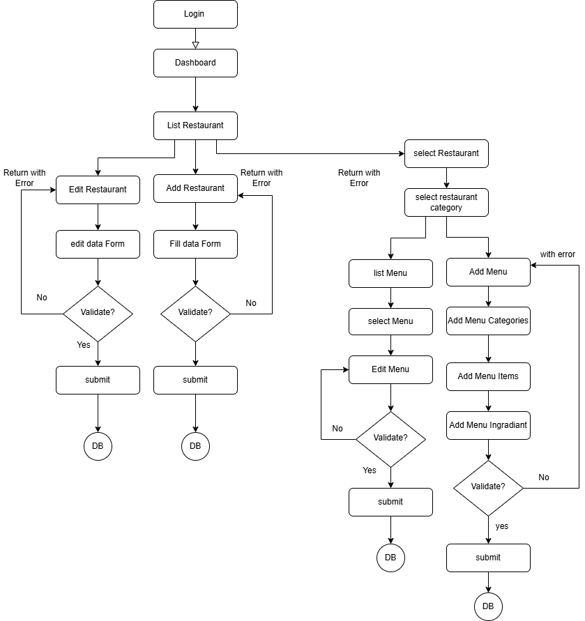
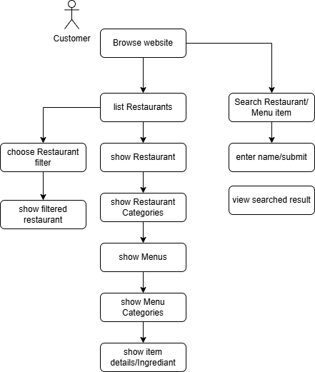
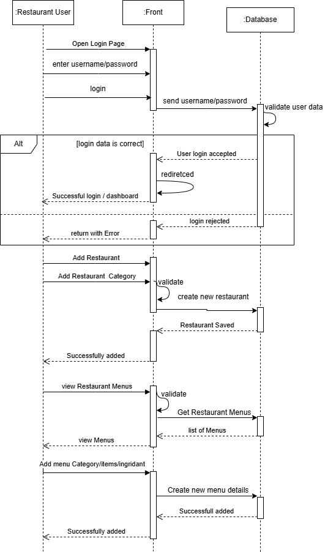
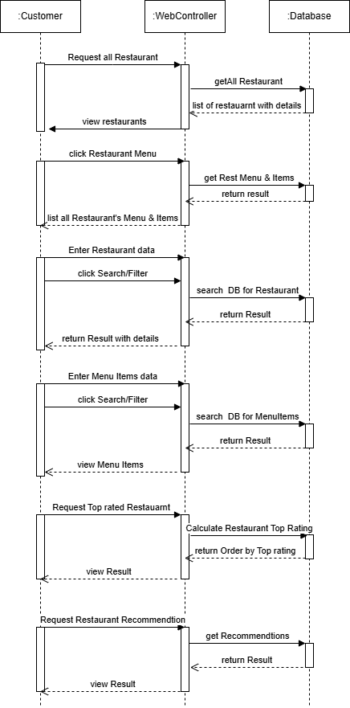

## 🍽️ Javeats Lite

**Javeats Lite** is a lightweight restaurant browsing and ordering system designed to make discovering food and placing orders fast and effortless.  
The platform allows users to explore a variety of restaurants, browse detailed menus, and place orders through a clean and intuitive interface.

The goal of Javeats Lite is to simplify the food ordering experience by providing a user-friendly solution that connects customers with restaurants in a seamless and efficient way.

---

## ✨ Features

### 🛒 Cart Management
**Functions:**
- Database design for cart and cart items
- Add items to cart
- Modify cart contents
- View cart details
- Update item quantities
- Remove items from the cart
- Clear all cart items
- Checkout and convert cart into an order
  
 ### 👤 User Registration & Authentication
 **Functions:**
- Database design for users, roles, and permissions
- RESTful API endpoints for authentication and user management:
  - Sign up
  - Login
  - Forgot password
  - Email verification or OTP verification
  - User / Customer profile management
  - Logout
  - Social media authentication
  - Enable or disable user accounts
- Role-based access control (RBAC) and permissions management

### 🏪 Restaurant / Menu Management
**Functions:**
- Database design for restaurants, menus, categories, and related entities
- RESTful API endpoints for restaurant and menu operations:
  - Add a restaurant
  - Update restaurant details
  - Enable or disable restaurant availability
  - View all restaurants (customer browsing)
  - Create a new menu
  - Update existing menus
  - Delete menus
  - View menu history (restaurant side)
  - View list of available menus
  - Search restaurants using filters
  - Search menu items using filters
  - View top-rated restaurants
  - Restaurant recommendations


### 📦 Order Management
**Functions:**
- Database design for orders, order items, and statuses
- RESTful API endpoints for order processing:
  - Place orders
  - Cancel orders by customers or restaurants
  - Update order status (order tracking)
  - View order history (customers and restaurants)
  - View order summary
  - View detailed order information
- Order confirmation via email or SMS
- Customer notifications on order status updates

### 🧑‍🤝‍🧑 Customer Management
**Functions:**
- Database design for customer profiles, addresses, and preferences
- RESTful API endpoints for customer operations:
  - View order history
  - Track current order status
  - Manage preferred payment methods (Visa, Cash on Delivery)
  - Address management (multiple delivery addresses)
  - Deactivate customer account
  - Submit ratings and comments
- Customer support via live chat

### 💳 Payment Integration
**Functions:**
- Database design for payments, transactions, and logs
- RESTful API endpoints for payment processing:
  - Integration with third-party payment gateways
  - Support for multiple payment methods
  - View payment transactions
- Payment error handling and recovery
- Payment verification and validation
- Generate payment receipts
- Payment auditing and logging
- Track and manage payment status


 ### Offers  
  Create and manage special offers, discounts, and promotional campaigns.

---

## ✨ Restayrant and Menu Analysis Design
### Restauarnt and Menu ERD 


---

### Restauarnt and Menu Flowchart
**Restaurant User**




**Customer**



---

### Restauarnt and Menu Sequence Diagram
**Restaurant User**



**Customer**



---

### Pseudo Code /Restauarnt User and Customer

```pseudo
FUNCTION CreateRestaurant(RestaurantData)
    IF NOT hasPermission(user, "MANAGE_RESTAURANT") THEN
        RETURN "Permission denied"
    END IF

    restaurant = NEW Restaurant(RestaurantData)

    SAVE(restaurant)
    RETURN "restaurant created"
END FUNCTION
```

```pseudo
FUNCTION CreateMenu(restaurantId, menuData)
    IF NOT hasPermission(user, "MANAGE_MENU") THEN
        RETURN "Permission denied"
    END IF

    menu = NEW Menu(menuData)
    menu.restaurantId ← restaurantId

    SAVE(menu)
    RETURN "Menu created"
END FUNCTION
```

```pseudo
FUNCTION GetTopRatedRestaurants(limit)
    restaurants = DB.getAllActiveRestaurants()

    FOR EACH restaurant IN restaurants
        ratings = DB.getRestaurantRatings(restaurant.id)

        IF ratings IS NOT EMPTY
            restaurant.avgRating = AVERAGE(ratings)
        ELSE
            restaurant.avgRating = 0
        END IF
    END FOR

    SORT restaurants BY avgRating DESC
    RETURN TOP restaurants LIMIT limit
END FUNCTION

```

```pseudo
FUNCTION GetMenuItems(menuId)

    menus = DB.findMenusItems(menuId)

    IF menus IS EMPTY THEN
        RETURN "No menus found"
    END IF

    FOR EACH menu IN menus
        menu.items = DB.findMenuItemsByMenu(menu.id)
    END FOR

    RETURN menus
END FUNCTION

```


